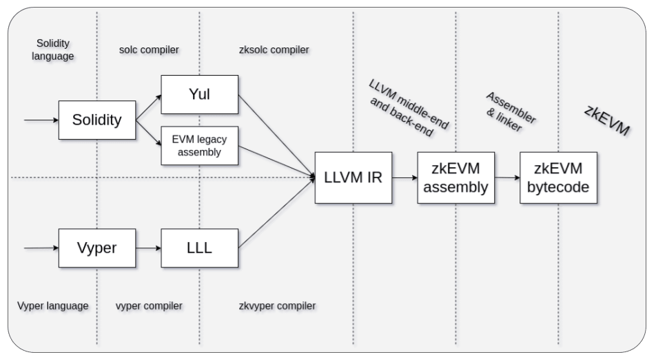

# ZkSolc Compiler Internals

Reviewer-oriented notes on how zksolc / EraVM verification resolves and runs
compilers. Companion to the "Solc Compiler Internals" section in `CLAUDE.md`.



_zkSync's compiler toolchain: a high-level frontend (zksolc) drives a Solidity
frontend, which feeds a shared LLVM-based backend that emits EraVM bytecode._

## Three compilers, three roles

zksolc verification involves three distinct compiler binaries. zksolc is the
orchestrator; the other two are interchangeable backends it shells out to via
`--solc <path>`.

| Compiler          | Role                                                                                     | Repo                                                                            | Filename pattern                     | Version examples                                                           |
| ----------------- | ---------------------------------------------------------------------------------------- | ------------------------------------------------------------------------------- | ------------------------------------ | -------------------------------------------------------------------------- |
| **zksolc**        | EraVM wrapper; takes Solidity standard JSON, spawns a solc backend, emits EraVM bytecode | `matter-labs/era-compiler-solidity` (≥1.5) or `matter-labs/zksolc-bin` (legacy) | `zksolc-<platform>-v<version>[.exe]` | `v1.5.16`, `v1.4.1`, `vm-1.5.0-a167aa3` (one-off)                          |
| **era-solc**      | Matter Labs' fork of solc with EraVM patches; invoked by zksolc as the `--solc` backend  | `matter-labs/era-solidity`                                                      | `solc-<platform>-<version>[.exe]`    | `0.8.30-1.0.2`, `0.8.26-1.0.1`, `0.7.6-1.0.1` (sometimes `zkVM-`-prefixed) |
| **upstream solc** | Plain Ethereum solc; also usable as zksolc's `--solc` backend                            | `binaries.soliditylang.org/bin/` (reused via the existing solc downloader)      | (existing solc convention)           | `v0.8.26+commit.8a97fa7a`, `0.8.26`                                        |

The era-solc version format is `<solc-semver>-<era-edition>`. Editions: `1.0.0`,
`1.0.1`, `1.0.2`. Edition `1.0.0` only covers solc ≤ 0.8.25; edition `1.0.2`
requires zksolc ≥ 1.5.

Upstream solc is used because block-explorer submissions usually only know the
commit-bearing solc version, not the era-solc edition. `ZkSolcCompilation` tries
upstream solc first (when given a commit-bearing version), then falls back
through era-solc candidates.

## How Sourcify drives zksolc, and how zksolc drives solc

zksolc does not compile Solidity itself — it is a **wrapper around solc**. It
takes Solidity source, hands it to a real Solidity compiler for the front-end
output (AST, Yul / EVM-legacy IR), then runs that through its own LLVM-based
backend to emit EraVM bytecode. So one EraVM compilation is a two-process chain:

```
Sourcify ──spawn──▶ zksolc ──spawn──▶ solc (era-solc or upstream)
```

**1. Sourcify spawns only zksolc.** For EraVM contracts Sourcify never runs solc
directly. It resolves _two_ binaries up front — the `zksolc` executable and a
solc backend — but spawns only `zksolc` as a child process (`useZkSolcCompiler`
→ `spawnCompiler`). The Standard JSON input is written to zksolc's **stdin**;
the Standard-JSON-shaped output is read back from its **stdout**.

**2. Sourcify tells zksolc where solc is.** zksolc neither bundles nor downloads
solc — it must be handed a path. `getZkSolcStandardJsonArgs` builds the argv:

```
--standard-json  --solc <solcPath>  --allow-paths <tmpDir>
```

`--solc` is the whole interface: it points zksolc at the backend binary Sourcify
already resolved (era-solc or upstream solc — see the table above).
`--allow-paths` confines file access to a freshly created temp directory, which
Sourcify deletes once the compile finishes.

**3. zksolc spawns solc.** Under `--standard-json`, zksolc reads the JSON from
stdin, spawns the `--solc` binary as _its own_ child process, feeds it the
Solidity sources, and collects the front-end output. Its LLVM backend turns that
into EraVM bytecode, and zksolc writes the combined output to stdout.

The backend must be a **native solc binary** — zksolc spawns it as a child
process, so the Emscripten `soljson` JS build cannot be used for EraVM
verification. `getZkSolcBaseSolcExecutable` therefore only ever resolves native
binaries: era-solc (always native) or upstream solc via the native-solc
downloader.

Sourcify's responsibility is therefore narrow: **resolve both binaries, pass the
JSON in, pass `--solc` so zksolc can find the backend, parse the JSON out.** The
solc invocation itself is entirely zksolc's doing — Sourcify only ever talks to
one process.

## The 1.5.0 split

zksolc changed its API/CLI shape at 1.5.0. Three practical consequences:

**1. CLI shape.** Before 1.5.0, certain settings are passed as **CLI flags**
rather than via standard JSON:

- `--system-mode` ← `settings.enableEraVMExtensions` / `settings.isSystem`
- `--force-evmla` ← `settings.forceEVMLA` / `settings.forceEvmla`

`getZkSolcStandardJsonArgs` in `zksolcCompiler.ts` handles this mapping. From
1.5.0 onward these go through standard JSON unchanged.

**2. Output selection.** Pre-1.5 zksolc rejects `evm` in `outputSelection`.
`mergeOutputSelection` in `ZkSolcCompilation.ts` selects `[abi, metadata]` for
pre-1.5 vs `[abi, metadata, evm]` for ≥1.5.

**3. era-solc edition compatibility.** Edition `1.0.2` is only available with
zksolc ≥ 1.5. The candidate-expansion logic excludes it for older zksolc.

The version-comparison helper is `isZkSolcVersionAtLeastV15` — hardcoded
threshold, no `target` parameter (all callers compare against 1.5.0). It
special-cases `vm-1.5.0-a167aa3` as <1.5 because that string is a 1.5.0
pre-release build that `semver.parse` rejects.

## Two release repos for zksolc

- **Modern (`era-compiler-solidity`):** zksolc ≥ 1.5. Release tags are bare
  versions like `1.5.16` (no `v` prefix).
- **Legacy (`zksolc-bin`):** pre-1.5 zksolc. Release tags are `v1.4.1` style
  (with `v`).

`fetchAndSaveCompiler` strips the `v` for the modern repo (default
`stripTagVersionV=true`) and keeps it for the legacy repo (`false` at the legacy
call site). `getZkSolcExecutable` tries the modern repo first, falls back to
legacy on 404.

## Linux libc: `-gnu` vs `-musl`

zksolc Linux binaries are published in two libc flavors:

- `-gnu` (glibc; Ubuntu, Debian, Fedora, RHEL, Arch — the common case)
- `-musl` (musl libc; Alpine, Void)

These are ABI-incompatible — a gnu binary won't run on a musl-only system and
vice versa. The suffix comes from Rust's target-triple convention
(`x86_64-unknown-linux-gnu` etc.), which Matter Labs uses to name release
artifacts.

`findZkSolcPlatform()` always returns `-gnu` on Linux. `getZkSolcFileNameCandidates`
then produces both `-gnu` and `-musl` filenames. `getZkSolcExecutable` tries
each in turn — on a glibc host, the gnu binary runs and we stop; on Alpine, the
gnu binary fails the `--version` check, we fall through to musl. There's no
explicit libc detection — the code just tries the binary and sees if it
executes.

**Windows note:** `findZkSolcPlatform()` returns `windows-amd64-gnu` because
Matter Labs publishes the Windows zksolc as a MinGW build (the `-gnu` suffix
here means "MinGW," not "glibc"). macOS has no libc split — single artifact per
platform.

**era-solc has no libc fallback.** The `era-solidity` repo publishes a single
Linux build under `solc-linux-amd64-<version>` with no `-gnu`/`-musl` suffix.

## Metadata / CBOR auxdata

EraVM bytecode carries trailing metadata the same way EVM bytecode does, but the
encoding changed across zksolc versions and the EraVM word model adds a wrinkle.
This section documents how Sourcify splits, masks, and verifies that metadata.
The `AuxdataStyle.ZKSYNC` enum in `bytecode-utils` selects this behavior.

### Two encodings, split at zksolc 1.5.13

zksolc switched its default metadata format at **1.5.13** (per the
`era-compiler-solidity` release notes):

| zksolc         | Metadata appended to bytecode                                                                           | Mask source                           |
| -------------- | ------------------------------------------------------------------------------------------------------- | ------------------------------------- |
| **≤ 1.5.12**   | bare **keccak256 hash** of the metadata (32 bytes, no CBOR)                                             | `generateEraVmMetadataHashPosition`   |
| **≥ 1.5.13**   | **CBOR** payload (IPFS hash + compiler versions) + 2-byte length                                        | `splitAuxdata` (ZKSYNC) → CBOR branch |
| any, opted out | nothing (`--no-cbor-metadata` / `metadata.bytecodeHash: none` / `hashType: none` / `appendCBOR: false`) | `isEraVmMetadataDisabled` → `{}`      |

1.5.13 added CBOR-encoded IPFS as the default, added `--no-cbor-metadata`, and
deprecated the keccak256 hash type. The test fixtures use a 1.5.7 tail (keccak)
and a 1.5.15 tail (CBOR) as representatives of the two eras — the meaningful
boundary is **1.5.13**, not the exact fixture versions.

### The ≥1.5.13 CBOR layout vs. standard solc

The CBOR map is **structurally identical to solc's** — an `a2` map with `ipfs`
(CIDv0, `5822 1220…`) and `solc` keys, followed by a 2-byte big-endian length:

```
a2 64 'ipfs' 5822 1220<32-byte hash> 64 'solc' 78 24 "zksolc:1.5.15;solc:0.8.26;llvm:1.0.2"
```

Two differences from solc:

1. **The `solc` value is a descriptive string** (`zksolc:…;solc:…;llvm:…`) rather
   than solc's 3 raw version bytes. `decode()` already handles string-encoded
   `solc` (the nightly-build branch), so this needs no special casing.
2. **Word-alignment zero padding is prepended** before the CBOR so the whole
   metadata block fills EraVM 32-byte words. Standard solc has no padding.

Everything else — the trailing 2-byte length convention and the CBOR map shape —
is the same. So EraVM CBOR splitting is the **Solidity split plus leading zero
padding**, not a fundamentally different format.

### The EraVM word rule (why "exactly one" extra zero word)

Valid EraVM bytecode must be a whole number of 32-byte words **and** an **odd**
number of them — i.e. `length % 64 == 32` (plus a `2^16`-word ceiling). This is a
deployment-format invariant tied to the versioned bytecode hash, not a quirk of
the metadata. See the [ZKsync contract-deployment docs][zk-deploy] and Matter
Labs' [EraVM binary-layout doc][zk-binary].

The metadata block already pads `[cbor][length]` up to a word boundary (the
`Math.ceil(… / 32) * 32` in `splitEraVmAuxdata`). But that alignment alone can
leave the _total_ word count even; to flip it back to odd, zksolc may prepend
**one** additional all-zero 32-byte word before the block. That is why the split
absorbs exactly one preceding zero word (the `paddingWordStart` backtrack in
`bytecode.ts`, mirrored in `ZkSolcCompilation.ts`) rather than greedily stripping
an arbitrary run of zeros — only a single odd-parity word is ever added.

[zk-deploy]: https://docs.zksync.io/zksync-protocol/era-vm/differences/contract-deployment
[zk-binary]: https://matter-labs.github.io/era-compiler-solidity/latest/eravm/07-binary-layout.html

### Detection is content-based, not version-based

Unlike compiler _invocation_ (version-gated via `isZkSolcVersionAtLeastV15`),
metadata _format_ detection is feature-detection on the bytecode: read the last
2 bytes as a length, extract that many bytes, and try to CBOR-decode them. Decode
succeeds → CBOR style; decode fails → fall back to the keccak hash region. The
1.5.7 keccak fixture bails because its trailing bytes parse as an out-of-range
length. (A version backstop would harden the two unlikely false-positive
directions — a keccak hash that happens to decode as CBOR, or a modern contract
wrongly treated as keccak — but the format itself is recovered from content.)

### The padding is part of the auxdata region, and decoding strips it

`splitAuxdata` (ZKSYNC) returns the **whole metadata block** as auxdata —
`[zero padding][cbor]` plus the trailing 2-byte length — not just the CBOR. The
padding lives inside the auxdata region on purpose: it is **metadata-induced** (it
only exists to word-align the appended metadata; strip the metadata and that
padding is gone), so it belongs to the region Sourcify masks, not to execution
bytecode.

Why it must be in the auxdata region: to verify a contract whose onchain bytecode
has metadata **absent** against a recompilation that has it **present** (or vice
versa), the _entire_ difference — padding included — has to be one maskable /
deletable unit. If the padding were left in execution bytecode, deleting the
auxdata would leave `[exec][padding]`, whose length can never reconcile with a
bare `[exec]`, foreclosing that match. Keeping the padding in auxdata keeps that
door open. (The current delete path still assumes a Solidity `fe` separator, so
fully wiring present-vs-absent for EraVM needs additional work — but the padding
placement is the precondition.)

The cost is that the auxdata is no longer decodable front-to-back: CBOR is read
**from byte 0**, and the leading `0x00…` padding makes `cbor-x` throw
`Data read, but end of buffer not reached`. So **decoding strips the padding
first.** A CBOR map always starts with a major-type-5 byte (`0xa1`/`0xa2`/…), never
`0x00`, so removing leading zero bytes unambiguously locates the payload:

- `decode(bytecode, AuxdataStyle.ZKSYNC)` reuses the Solidity decode branch after
  `auxdata.replace(/^(?:00)+/, '')`; the CBOR map is otherwise identical to
  Solidity's (the `solc` value is a descriptive `zksolc:…;solc:…;llvm:…` string,
  already handled by the nightly-build branch).
- `extractAuxdataTransformation` uses a padding-tolerant `auxdataContainsCbor`
  helper (same leading-zero strip) wherever it validates a slice is CBOR.

This strip is a no-op for Solidity/Vyper auxdata (no leading padding), so the
shared paths stay correct. External consumers of the stored `cbor_auxdata` value
must apply the same strip to decode it — the one compatibility wrinkle of keeping
the padding in the value.

### Keccak (≤1.5.12) is still auxdata, so partial matches work

The bare keccak hash is the hash of the metadata: it differs between
recompilation and onchain whenever the metadata differs, so it **must be masked**
for a partial match — exactly like a CBOR metadata hash. `generateEraVmMetadataHashPosition`
registers the 32-byte hash (plus an optional preceding zero word for the EraVM
word rule above) as cborAuxdata position `'1'`, so it is masked, not compared. A keccak
hash is **not** CBOR, though, so the auxdata-replacement transform must not try to
CBOR-validate it.

### `validateCbor` is per-position, not per-style

`extractAuxdataTransformation` validates that each onchain auxdata slice is a real
CBOR object before masking it. Whether to validate is decided **per auxdata
position** by whether the _recompiled_ auxdata at that position is itself CBOR
(via the padding-tolerant `auxdataContainsCbor`):

- ≥1.5.13 CBOR positions → recompiled value is CBOR → the onchain slice is
  validated, same as Solidity.
- ≤1.5.12 keccak positions → recompiled value is a raw hash, not CBOR →
  validation is skipped for that position (it is still masked).

This replaced the earlier blanket `validateCbor: false` for all of ZKSYNC, which
masked the keccak case correctly but also silently disabled validation for the
CBOR case where it should run.
